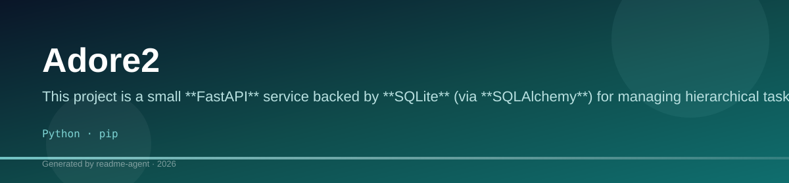
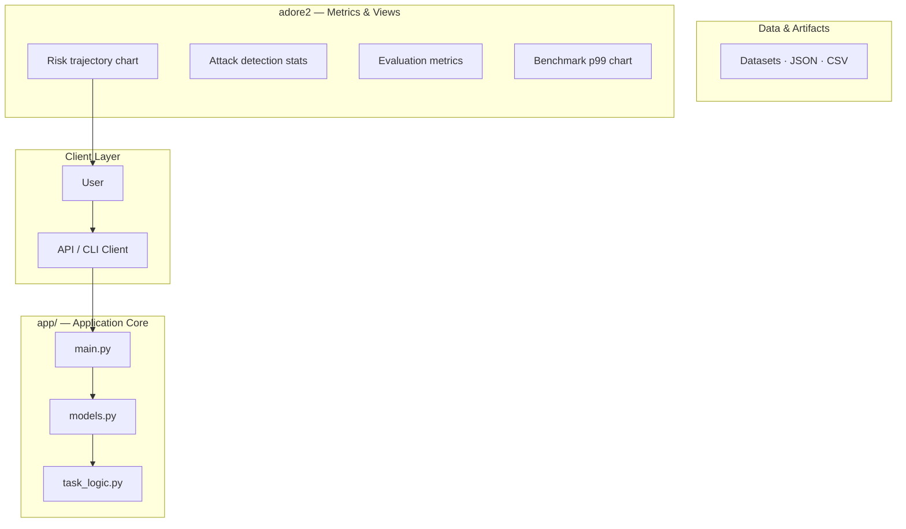
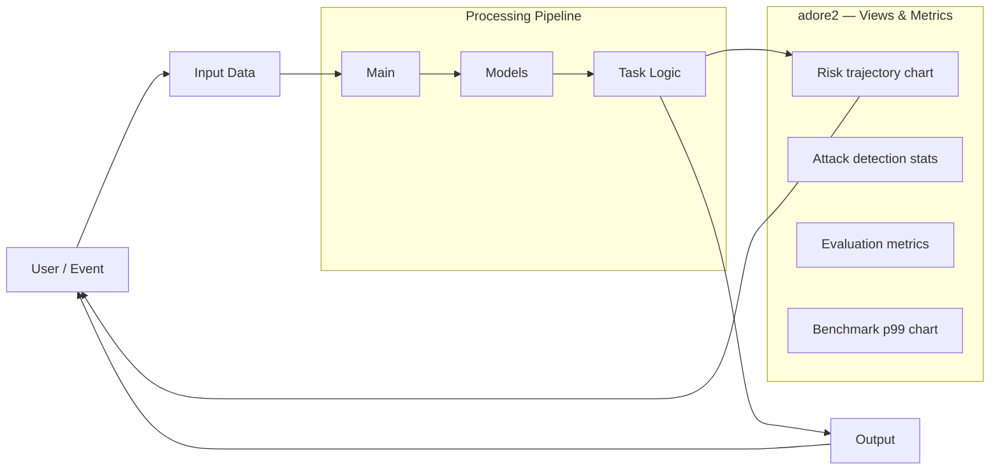
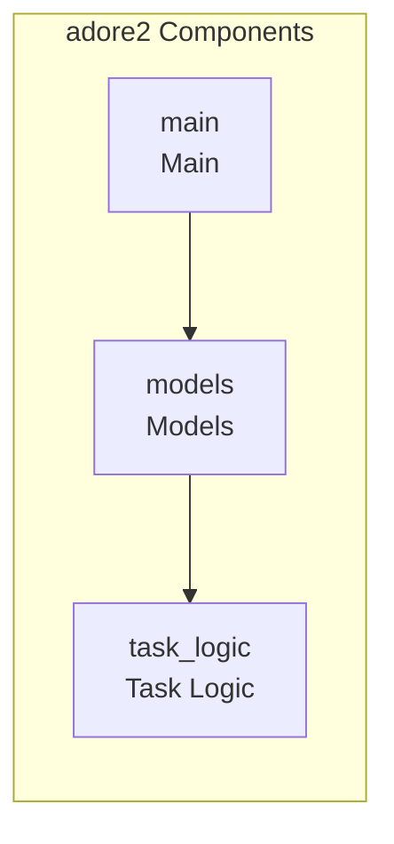
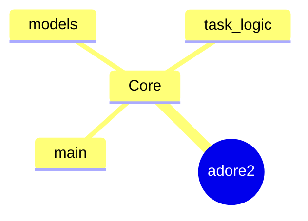

# Adore2: FastAPI-Powered Task Management System

A FastAPI application utilizing SQLAlchemy and dedicated logic modules to manage and process tasks based on complex business rules.

## Overview

Adore2 is a backend API service built with FastAPI. Its primary function is to handle CRUD operations and execute complex, multi-step business logic related to task management. The application separates concerns cleanly: `models.py` handles database persistence (SQLAlchemy), `task_logic.py` encapsulates all core business rules, and `main.py` serves as the API gateway, managing routing, request validation (Pydantic), and dependency injection.

## Key Features

- RESTful API endpoints for task management (e.g., retrieving tasks, executing specific task logic).
- Database persistence using SQLAlchemy and SQLite.
- Separation of concerns, isolating complex business logic into dedicated modules.
- Input validation and request handling via FastAPI and Pydantic.

## Technology Stack

- Python
- FastAPI
- SQLAlchemy
- Pydantic
- Uvicorn
- SQLite
- RapidFuzz

# StoreWise Backend API

This repository provides a robust backend API built with FastAPI, designed to manage and query task data. It implements standard CRUD operations and complex, business-logic-driven endpoints to solve various data analysis scenarios.

## 🚀 Getting Started

### Prerequisites
*   Python 3.8+
*   pip

### Installation
1.  **Clone the repository:**
    ```bash
git clone <repository-url>
cd storewise-backend-assignment
```
2.  **Create and activate a virtual environment:**
    ```bash
python -m venv venv
source venv/bin/activate  # On Linux/macOS
venv\Scripts\activate   # On Windows
```
3.  **Install dependencies:**
    ```bash
pip install -r requirements.txt
```
4.  **Run the application:**
    ```bash
uvicorn app.main:app --reload
```

### API Base URL
*   The API is accessible at `http://127.0.0.1:8000` (or the port specified by `uvicorn`).

## 💾 Data Model

The application uses a single SQLite database (`database.db`) and manages the `tasks` table. Each task record contains the following fields:

| Field | Type | Description |
| :--- | :--- | :--- |
| `id` | Integer | Primary Key, unique identifier. |
| `title` | String | The title of the task. |
| `description` | String | Detailed description of the task. |
| `due_date` | Date | The date the task is due (YYYY-MM-DD). |
| `is_completed` | Boolean | Status of the task (True/False). |

## 🛠️ API Endpoints Summary

The API is structured around the `/tasks` endpoint and specialized query endpoints for complex data retrieval.

### 1. Task Management (CRUD)

| Method | Endpoint | Description | Body/Parameters |
| :--- | :--- | :--- | :--- |
| `POST` | `/tasks` | Creates a new task record. | Requires `title`, `description`, `due_date`, `is_completed`. |
| `GET` | `/tasks` | Retrieves a list of all tasks. | Optional query parameters for filtering. |
| `PUT` | `/tasks/{task_id}` | Updates an existing task record. | Requires `task_id` in the path and updated fields in the body. |
| `DELETE` | `/tasks/{task_id}` | Deletes a task record by ID. | Requires `task_id` in the path. |

### 2. Advanced Query Endpoints (Read-Only)

These endpoints implement specific business logic queries based on the task data.

*   **Q2: Tasks Due Next Week:** Retrieves all tasks whose `due_date` falls within the next seven days.
*   **Q3: Tasks Due Before Today:** Retrieves all tasks that are overdue (due date is before the current date).
*   **Q4: Tasks Completed Last Month:** Filters and returns tasks that were marked as completed within the last 30 days.
*   **Q5: Tasks Due on a Specific Day:** Filters tasks based on a provided `due_date` parameter.
*   **Q6: Tasks Due on a Weekend:** Identifies and returns tasks due on a Saturday or Sunday.
*   **Q7: Tasks Due in a Specific Range:** Retrieves tasks within a specified start and end date range.
*   **Q8: Filtered Tasks (Complex):** A highly filtered query that retrieves tasks that are: 1) Not completed, 2) Due within a specified date range, AND 3) Not due on a Sunday.

### 3. Simulation Endpoint

*   **Q9: Task Simulation:** Simulates a time-consuming background process (e.g., generating a large report). This endpoint uses a thread pool to demonstrate asynchronous, blocking operations, returning a result after a simulated delay.

## 💡 Best Practices

*   **Error Handling:** The API utilizes FastAPI's built-in exception handling, returning standard HTTP status codes (e.g., 404 for not found, 422 for validation errors).
*   **Data Integrity:** All database operations are handled within SQLAlchemy sessions, ensuring transactional integrity.

## Setup Guide

### Backend Setup

```bash

python -m venv .venv
# Windows: .venv\Scripts\activate
# Linux/macOS: source .venv/bin/activate
pip install -r requirements.txt
```

### Running the Application

1. **Install Python dependencies**

```bash
pip install -r requirements.txt

```

## System Architecture

High-level system design, data flows, API map, and workflow pipelines derived from the repository structure.

### System Architecture



### Data Flow & Charts Pipeline



### Component & API Map



### Application Page Map


